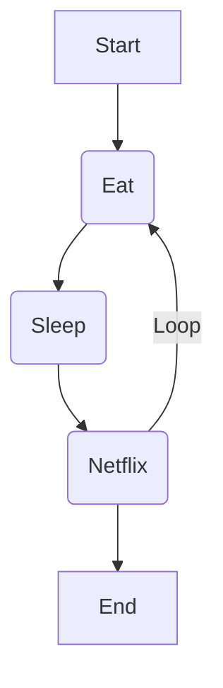

# The Approach

> This is the start of the documentation repository for the approach. Diagrams, artefacts and models will be stored in a library

---

```mermaid
graph TD
    A[Start] --> B(Eat)
    B --> C(Sleep)
    C --> D(Netflix)
    D -->|Loop| B
    D --> E[End]
```
--- 

# What's Next

Coming Soon.

